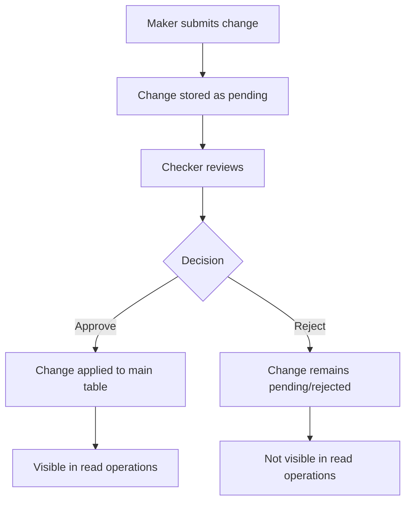

# Maker-Checker Workflow Examples

This document provides comprehensive examples for the Maker-Checker approval process in the AllConfig system. The maker-checker workflow ensures that all configuration changes require approval before they become visible in read operations.

## Table of Contents
- [Overview](#overview)
- [Workflow Process](#workflow-process)
- [Maker Operations](#maker-operations)
- [Checker Operations](#checker-operations)
- [Read Operations](#read-operations)
- [Complete Workflow Examples](#complete-workflow-examples)

---

## Overview

The maker-checker process works as follows:

1. **Maker** submits configuration changes for approval
2. Changes are stored in pending state (not visible in read operations)
3. **Checker** reviews and either approves or rejects the changes
4. **Approved changes** become visible in all read operations
5. **Rejected changes** remain hidden and can be resubmitted

## Workflow Process



---

## Maker Operations

### 1. Submit Configuration for Creation

```bash
curl -X POST http://localhost:8080/allconfig-operation \
  -H "Content-Type: application/json" \
  -d '{
    "type": "mysql",
    "host": "localhost",
    "port": 3306,
    "username": "root",
    "password": "password",
    "database": "testdb",
    "operation": "submit_create",
    "key": "api_base_url",
    "value": "https://api.newservice.com",
    "description": "Base URL for new API service",
    "maker_id": "user123"
  }'
```

**Response:**
```json
{
  "success": true,
  "message": "AllConfig operation 'submit_create' completed",
  "data": {
    "request_id": "f47ac10b58cc4372a5670e02b2c3d479",
    "status": "submitted_for_approval",
    "operation": "create",
    "config_key": "api_base_url",
    "maker_id": "user123"
  }
}
```

### 2. Submit Configuration for Update

```bash
curl -X POST http://localhost:8080/allconfig-operation \
  -H "Content-Type: application/json" \
  -d '{
    "type": "mysql",
    "host": "localhost",
    "port": 3306,
    "username": "root",
    "password": "password",
    "database": "testdb",
    "operation": "submit_update",
    "key": "max_connections",
    "value": "200",
    "description": "Increased max connections for high traffic",
    "maker_id": "user123"
  }'
```

### 3. Submit Configuration for Deletion

```bash
curl -X POST http://localhost:8080/allconfig-operation \
  -H "Content-Type: application/json" \
  -d '{
    "type": "mysql",
    "host": "localhost",
    "port": 3306,
    "username": "root",
    "password": "password",
    "database": "testdb",
    "operation": "submit_delete",
    "key": "deprecated_setting",
    "description": "Removing deprecated configuration",
    "maker_id": "user123"
  }'
```

### 4. Check My Requests Status

```bash
curl -X POST http://localhost:8080/allconfig-operation \
  -H "Content-Type: application/json" \
  -d '{
    "type": "mysql",
    "host": "localhost",
    "port": 3306,
    "username": "root",
    "password": "password",
    "database": "testdb",
    "operation": "get_my_requests",
    "maker_id": "user123",
    "limit": 10
  }'
```

**Response:**
```json
{
  "success": true,
  "message": "AllConfig operation 'get_my_requests' completed",
  "data": [
    {
      "request_id": "f47ac10b58cc4372a5670e02b2c3d479",
      "config_key": "api_base_url",
      "config_value": "https://api.newservice.com",
      "operation": "create",
      "status": "pending",
      "requested_at": "2024-01-01T10:00:00Z",
      "processed_at": null,
      "checker_id": null,
      "approval_comment": null
    }
  ]
}
```

---

## Checker Operations

### 1. Get Pending Approvals

```bash
curl -X POST http://localhost:8080/allconfig-operation \
  -H "Content-Type: application/json" \
  -d '{
    "type": "mysql",
    "host": "localhost",
    "port": 3306,
    "username": "root",
    "password": "password",
    "database": "testdb",
    "operation": "get_pending_approvals",
    "limit": 20
  }'
```

**Response:**
```json
{
  "success": true,
  "message": "AllConfig operation 'get_pending_approvals' completed",
  "data": [
    {
      "request_id": "f47ac10b58cc4372a5670e02b2c3d479",
      "config_key": "api_base_url",
      "config_value": "https://api.newservice.com",
      "description": "Base URL for new API service",
      "operation": "create",
      "maker_id": "user123",
      "requested_at": "2024-01-01T10:00:00Z",
      "previous_value": null
    },
    {
      "request_id": "a23bc45d67ef8901234567890abcdef1",
      "config_key": "max_connections",
      "config_value": "200",
      "description": "Increased max connections for high traffic",
      "operation": "update",
      "maker_id": "user456",
      "requested_at": "2024-01-01T11:00:00Z",
      "previous_value": "100"
    }
  ]
}
```

### 2. Approve a Request

```bash
curl -X POST http://localhost:8080/allconfig-operation \
  -H "Content-Type: application/json" \
  -d '{
    "type": "mysql",
    "host": "localhost",
    "port": 3306,
    "username": "root",
    "password": "password",
    "database": "testdb",
    "operation": "approve_request",
    "request_id": "f47ac10b58cc4372a5670e02b2c3d479",
    "checker_id": "admin001",
    "approval_comment": "Approved - new API service looks good"
  }'
```

**Response:**
```json
{
  "success": true,
  "message": "AllConfig operation 'approve_request' completed",
  "data": {
    "request_id": "f47ac10b58cc4372a5670e02b2c3d479",
    "status": "approved",
    "checker_id": "admin001",
    "approval_comment": "Approved - new API service looks good",
    "applied_result": {
      // Result of the actual configuration creation/update
    }
  }
}
```

### 3. Reject a Request

```bash
curl -X POST http://localhost:8080/allconfig-operation \
  -H "Content-Type: application/json" \
  -d '{
    "type": "mysql",
    "host": "localhost",
    "port": 3306,
    "username": "root",
    "password": "password",
    "database": "testdb",
    "operation": "reject_request",
    "request_id": "a23bc45d67ef8901234567890abcdef1",
    "checker_id": "admin001",
    "approval_comment": "Rejected - max connections too high for current infrastructure"
  }'
```

### 4. View Approval History

```bash
curl -X POST http://localhost:8080/allconfig-operation \
  -H "Content-Type: application/json" \
  -d '{
    "type": "mysql",
    "host": "localhost",
    "port": 3306,
    "username": "root",
    "password": "password",
    "database": "testdb",
    "operation": "get_approval_history",
    "limit": 50
  }'
```

---

## Read Operations

All standard read operations now only return **APPROVED** configurations:

### 1. Read All Configurations (Only Approved)

```bash
curl -X POST http://localhost:8080/allconfig-operation \
  -H "Content-Type: application/json" \
  -d '{
    "type": "mysql",
    "host": "localhost",
    "port": 3306,
    "username": "root",
    "password": "password",
    "database": "testdb",
    "operation": "read_all"
  }'
```

**Note:** This will only return configurations with `status = 'approved'`. Pending configurations are not visible.

### 2. Read Specific Configuration

```bash
curl -X POST http://localhost:8080/allconfig-operation \
  -H "Content-Type: application/json" \
  -d '{
    "type": "mysql",
    "host": "localhost",
    "port": 3306,
    "username": "root",
    "password": "password",
    "database": "testdb",
    "operation": "read",
    "key": "api_base_url"
  }'
```

### 3. Search Configurations (Only Approved)

```bash
curl -X POST http://localhost:8080/allconfig-operation \
  -H "Content-Type: application/json" \
  -d '{
    "type": "mysql",
    "host": "localhost",
    "port": 3306,
    "username": "root",
    "password": "password",
    "database": "testdb",
    "operation": "search",
    "search_term": "api"
  }'
```

### 4. Admin Read All (Including Pending) - For Admin Users

```bash
curl -X POST http://localhost:8080/allconfig-operation \
  -H "Content-Type: application/json" \
  -d '{
    "type": "mysql",
    "host": "localhost",
    "port": 3306,
    "username": "root",
    "password": "password",
    "database": "testdb",
    "operation": "read_all_admin"
  }'
```

---

## Complete Workflow Examples

### Example 1: New Configuration Workflow

```bash
#!/bin/bash

DB_CONFIG='{
  "type": "mysql",
  "host": "localhost",
  "port": 3306,
  "username": "root",
  "password": "password",
  "database": "testdb"
}'

echo "=== MAKER-CHECKER WORKFLOW EXAMPLE ==="

# Step 1: Maker submits new configuration
echo "1. Maker submits new configuration for approval..."
SUBMIT_RESPONSE=$(curl -s -X POST http://localhost:8080/allconfig-operation \
  -H "Content-Type: application/json" \
  -d "{
    $DB_CONFIG,
    \"operation\": \"submit_create\",
    \"key\": \"new_feature_enabled\",
    \"value\": \"true\",
    \"description\": \"Enable new feature flag\",
    \"maker_id\": \"developer001\"
  }")

echo "$SUBMIT_RESPONSE"
REQUEST_ID=$(echo "$SUBMIT_RESPONSE" | jq -r '.data.request_id')

echo -e "\nRequest ID: $REQUEST_ID"

# Step 2: Verify configuration is not visible in read operations
echo -e "\n2. Checking if configuration is visible (should be empty)..."
curl -s -X POST http://localhost:8080/allconfig-operation \
  -H "Content-Type: application/json" \
  -d "{
    $DB_CONFIG,
    \"operation\": \"read\",
    \"key\": \"new_feature_enabled\"
  }" | jq '.data'

# Step 3: Checker views pending approvals
echo -e "\n3. Checker views pending approvals..."
curl -s -X POST http://localhost:8080/allconfig-operation \
  -H "Content-Type: application/json" \
  -d "{
    $DB_CONFIG,
    \"operation\": \"get_pending_approvals\",
    \"limit\": 10
  }" | jq '.data'

# Step 4: Checker approves the request
echo -e "\n4. Checker approves the request..."
curl -s -X POST http://localhost:8080/allconfig-operation \
  -H "Content-Type: application/json" \
  -d "{
    $DB_CONFIG,
    \"operation\": \"approve_request\",
    \"request_id\": \"$REQUEST_ID\",
    \"checker_id\": \"admin001\",
    \"approval_comment\": \"Approved - feature ready for production\"
  }" | jq '.'

# Step 5: Verify configuration is now visible
echo -e "\n5. Checking if configuration is now visible..."
curl -s -X POST http://localhost:8080/allconfig-operation \
  -H "Content-Type: application/json" \
  -d "{
    $DB_CONFIG,
    \"operation\": \"read\",
    \"key\": \"new_feature_enabled\"
  }" | jq '.data'

echo -e "\n=== WORKFLOW COMPLETED ==="
```

### Example 2: Update Configuration Workflow

```bash
#!/bin/bash

# Step 1: Submit update request
echo "1. Submitting configuration update for approval..."
curl -X POST http://localhost:8080/allconfig-operation \
  -H "Content-Type: application/json" \
  -d '{
    "type": "mysql",
    "host": "localhost",
    "port": 3306,
    "username": "root",
    "password": "password",
    "database": "testdb",
    "operation": "submit_update",
    "key": "max_retry_attempts",
    "value": "5",
    "description": "Increased retry attempts for better reliability",
    "maker_id": "developer002"
  }'

# Wait for checker approval...

echo -e "\n2. After approval, the updated value becomes visible:"
curl -X POST http://localhost:8080/allconfig-operation \
  -H "Content-Type: application/json" \
  -d '{
    "type": "mysql",
    "host": "localhost",
    "port": 3306,
    "username": "root",
    "password": "password",
    "database": "testdb",
    "operation": "read",
    "key": "max_retry_attempts"
  }'
```

### Example 3: Rejection and Resubmission

```bash
#!/bin/bash

# Step 1: Submit configuration
echo "1. Developer submits configuration..."
RESPONSE=$(curl -s -X POST http://localhost:8080/allconfig-operation \
  -H "Content-Type: application/json" \
  -d '{
    "type": "mysql",
    "host": "localhost",
    "port": 3306,
    "username": "root",
    "password": "password",
    "database": "testdb",
    "operation": "submit_create",
    "key": "experimental_feature",
    "value": "enabled",
    "description": "Enable experimental feature",
    "maker_id": "developer003"
  }')

REQUEST_ID=$(echo "$RESPONSE" | jq -r '.data.request_id')

# Step 2: Checker rejects
echo -e "\n2. Checker rejects the request..."
curl -X POST http://localhost:8080/allconfig-operation \
  -H "Content-Type: application/json" \
  -d "{
    \"type\": \"mysql\",
    \"host\": \"localhost\",
    \"port\": 3306,
    \"username\": \"root\",
    \"password\": \"password\",
    \"database\": \"testdb\",
    \"operation\": \"reject_request\",
    \"request_id\": \"$REQUEST_ID\",
    \"checker_id\": \"admin001\",
    \"approval_comment\": \"Feature not ready for production - needs more testing\"
  }"

# Step 3: Developer checks their requests
echo -e "\n3. Developer checks their request status..."
curl -X POST http://localhost:8080/allconfig-operation \
  -H "Content-Type: application/json" \
  -d '{
    "type": "mysql",
    "host": "localhost",
    "port": 3306,
    "username": "root",
    "password": "password",
    "database": "testdb",
    "operation": "get_my_requests",
    "maker_id": "developer003"
  }'

# Step 4: Developer can resubmit with changes
echo -e "\n4. Developer resubmits with revised description..."
curl -X POST http://localhost:8080/allconfig-operation \
  -H "Content-Type: application/json" \
  -d '{
    "type": "mysql",
    "host": "localhost",
    "port": 3306,
    "username": "root",
    "password": "password",
    "database": "testdb",
    "operation": "submit_create",
    "key": "experimental_feature_v2",
    "value": "beta",
    "description": "Enable experimental feature in beta mode only - extensively tested",
    "maker_id": "developer003"
  }'
```

## Key Benefits

1. **Audit Trail**: Complete history of who made changes and who approved them
2. **Risk Mitigation**: No unauthorized changes can affect production
3. **Compliance**: Meets regulatory requirements for change management
4. **Segregation of Duties**: Clear separation between makers and checkers
5. **Transparency**: Full visibility into pending and processed requests

## Database Schema Support

The maker-checker workflow supports:
- **MySQL**: Uses ENUM types for status fields
- **PostgreSQL**: Uses CHECK constraints for data integrity
- **MongoDB**: Uses flexible document structure with proper indexing

## Best Practices

1. **Use descriptive maker_ids**: Use actual user IDs for proper audit trails
2. **Provide clear descriptions**: Help checkers understand the purpose of changes
3. **Regular approval reviews**: Check pending approvals frequently
4. **Proper rejection feedback**: Include specific reasons for rejection
5. **Monitor approval history**: Review patterns to improve processes

All operations maintain full backward compatibility while adding the security layer of maker-checker approval process!
